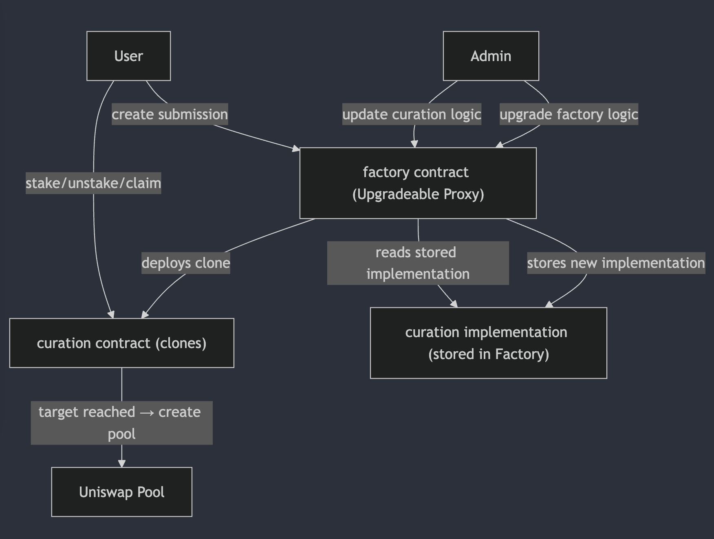
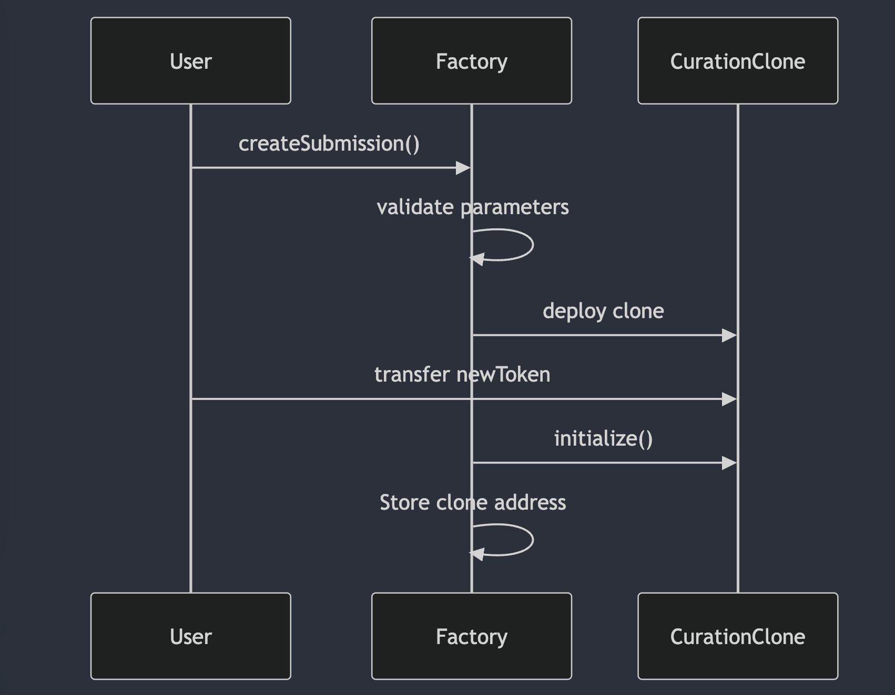
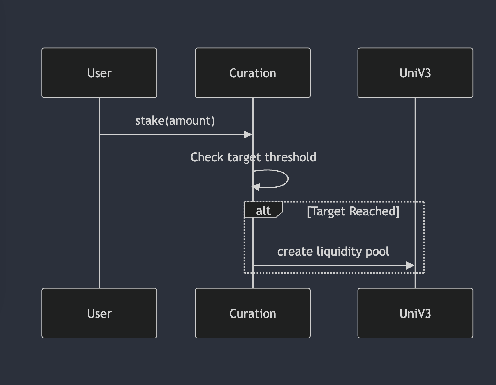

# Architecture & Design



# Table of Contents

1. [Example](#example)
2. [Example2](#example2)
3. [Third Example](#third-example)
4. [Fourth Example](#fourth-examplehttpwwwfourthexamplecom)

## Example

## Example2

## Third Example

## [Fourth Example](http://www.fourthexample.com)

## 1. Architecture Design Decisions

### **Clone Factory Pattern**

- Reduces deployment costs via proxy clones.
- Uses ERC-1167 minimal proxies for gas-efficient deployment
- Enables mass creation of curation contracts with shared logic via clones pattern
- Implementation upgrades affect only new deployments

### **Upgradeability Strategy**

- Transparent Upgradability Proxy for LaunchFactory updates
- Owner-controlled implementation upgrades
- Allows changing implementation contract for Curation

### **Liquidity Bootstrapping**

- Automated Uniswap V3 pool creation once sufficient tokens are staked
- Full-range liquidity positions for maximum exposure
- Price determined by tokens ratio

### **State Management**

- Two-stage lifecycle (Pending → Ended)
- Staked amounts tracking with mapping optimizations
- Token balances verified through SafeERC20

## 2. Contract Architecture

### 2.1 LaunchFactory

```solidity
contract LaunchFactory {
    // Core dependencies
    address public curationImplementation;
    address public positionManager;

    // Curation registry
    address[] public curations;

    // Lifecycle
    function createSubmission(CurationDetails) → clone
    function upgradeImplementation(address)

    // View
    function getCurationsData() → FullCurationInfo[]
}
```

### Submission Creation

```
User → createSubmission()
     ↓
Parameter Validation → Clone Creation → Token Transfer → Initialization
     ↓
Curation Added to Registry
```

### Upgrade Process

```
User → Factory → Clone ← Token Transfers
               ↓
           CurationList
```

### 2.2 Curation

```solidity
contract Curation {
    // Configuration
    CurationDetails public curationDetails;
    address public positionManager;

    // State
    CurationStatus public curationStatus;
    mapping(address → uint256) public stakedAmounts;

    // Lifecycle
    function initialize()
    function stake(uint256)
    function unstake(uint256)
    function claim()

    // Internal
    function _setUpPool() → address
}
```

### State Transitions

```
         initialize()
            ↓
[PENDING] → stake() → [ENDED]
  ↓    ↖      ↓
unstake()    claim()
```

## 3. Data Flow

### 3.1 Token Submission



### 3.2 Staking & Pool Creation



## 4. User Guide

### 1. Create Submition

```javascript
// prepare curationDetails object
const curationDetails = {
  newToken: "0x...", // ERC20 address
  curationToken: "0x...", // Staking token
  distributionAmount: 500000, // Tokens for distribution
  targetAmount: 100000, // Staking target
  liquidityAmount: 200000, // Liquidity pool tokens
  creator: "0x...", // Your address
};

// approve token transfer
newToken.approve(factory.address, totalAmount);

// create curation
factory.createSubmission(curationDetails);
```

### 2. Staking Tokens

Requirements:

- curation status == PENDING

```javascript
// approve curationTokens to new  instance
curationToken.approve(curationAddress, amount);

// invoke stake function on instance
curationContract.stake(amount);
```

### 3. Unstake Tokens

Requirements:

- curation status == PENDING
- user has stake

```javascript
// invoke unstake function on instance
curationContract.unstake(amount);
```

### 4. Claiming Rewards

Requirements:

- curation status == ENDED
- user has positive stake

```javascript
// invoke claim function on instance
curationContract.claim();
// claim amount = (stakedAmount / targetAmount) * distributionAmount
```

### 5. Curation Implementation Upgrade

Requirements:

- invoked from privileged account
- deployed new version of curation

```javascript
factory.upgradeImplementation(_newImplementation);
```

### 6. Factory Upgrade

Requirements:

- invoked from privileged account

```javascript
factory.upgradeImplementation(_newImplementation);
```
