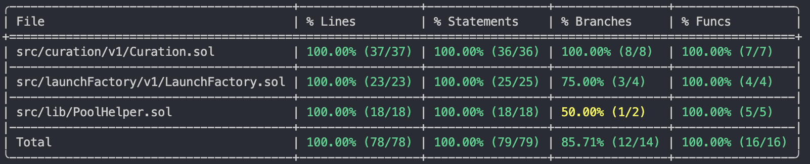

## About

A modular smart contract system enabling cost-effective token curation using proxy clones, transparent upgradeable proxies, staking, and Uniswap V3 liquidity bootstrapping.

## Design & Architecture

Detailed design document can be seen [here](./ABOUT.md)

## Technical documentation

```shell
forge doc --serve --port 4000 --open
```

[Soldidity Metrics](https://github.com/Consensys/solidity-metrics) report can also be seen [here](./solidity-metrics.html)

## Usage

### Build

```shell
forge build
```

### Test

Runs test suit

```shell
make test
```

### Audit

Runs static analyzers:

- [Slither](https://github.com/crytic/slither)
- [Aderyn](https://github.com/Cyfrin/aderyn)

```shell
make audit
```

Results available at [audit/](./audit/)

### Run Coverage

Current coverage:



To generate coverage report run:

```shell
make coverage
```

### Generate Coverage Report

```shell
make report
```

### Help

```shell
❯ make help
Usage: make [target]

Targets:
  test      Run tests with verbose output
  coverage  Show coverage summary
  report    Generate and open coverage report
  audit     Run security analysis
  clean     Remove build files
  snapshot  Create gas snapshot
```
